# Hello World

My name is **Bruno Rocha**. I have been working professionally with computers since **2000** and I am currently a programmer at [Red Hat](https://redhat.com).

At the beginning of my career I had the opportunity to work with different languages ​​and technologies, including _SQL, Perl, C, VB, PHP, C# and .NET_ and I went through some big companies like **Coelba** and **Palm Inc** where I learned a lot from excellent professionals.

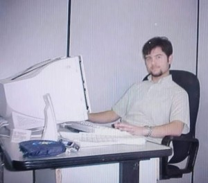
 _year 2000_ working as a MS Access 97 developer.

I started using Linux in 1998 out of curiosity coupled with a magazine that featured a [Conectiva Linux](https://en.wikipedia.org/wiki/Mandriva_Linux) CD-ROM and since then I have become an Open Source enthusiast.

I got to know the Python language through a Brazilian Linux distribution called [Kurumim](https://en.wikipedia.org/wiki/Kurumin) that used Python to automate many tasks and came with an excellent Python tutorial embedded in one of its KDE menus.

I studied Information Systems and, contrary to all curriculum, my graduation used [Pascal](https://en.wikipedia.org/wiki/Pascal_(programming_language)) and Delphi instead of the traditional C and Java.

My main programming language has been [Python](https://python.org) since 2007 and I have had the opportunity to work on projects of different sizes and scales for different areas such as Web Development, Test and Process Automation and I am also the maintainer of [some open source libraries](https://pypi.org/user/rochacbruno/) used by the Python community .

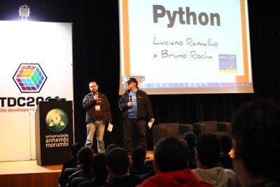

In 2008 I acted as a core developer of a well-known [web framework](https://web2py.com/) and through these contributions I gained experience in web development and maintenance of open-source projects and then in 2012 I co-published a [book about it](https://www.packtpub.com/web-development/web2py-application-development-cookbook). And in that same year I was nominated member of the Python Software Foundation, an organization where I work collaborating in the maintenance of the [Python Planet website](https://github.com/python/planet) and the Fellow Workgroup.

Since 2010 I have been dedicated to sharing knowledge with the software development community, especially educational content through video classes and also giving lectures at the main conferences and meetups of the Python community in Brazil and Portugal.

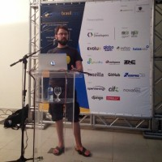

In 2013 I was the winner of the Dorneles Tremea award, an acknowledgment of the collaboration with the Brazilian Python community issued by APyB, an organization of which I have served as vice president and active collaborator for many years.

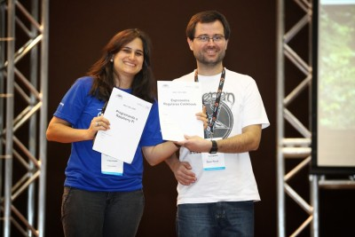

Using the Django framework I helped to develop some of the biggest content and news portals in Brazil and to develop a [high-scale CMS](https://github.com/opps/opps).

In 2014 I started to dedicate myself to the study of the Flask web framework and acted as Data Engineer and API developer on one of the biggest job boards in the world, developed large scale APIs focused on data science using Flask and published some articles and extensions and since then I've been dedicating myself to teaching Flask and Web Development.

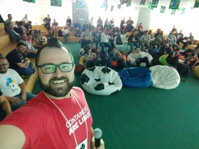

During this period I had the opportunity to create my main open source projects, including [Quokka CMS](https://github.com/quokkaproject), [Flasgger](https://github.com/flasgger) (extension for creating APis with openapi spec that is behind httpbin.org), several extensions for Flask and my main project that I actively maintain called [Dynaconf](https://github.com/dynaconf), a library to facilitate configuration management in Python projects.

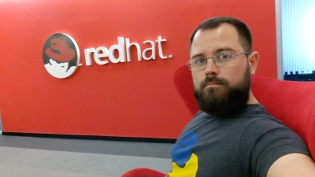

In 2016 I joined [Red Hat](https://redhat.com) to work as a Quality Engineer bringing my experience of developing frameworks and libraries to Red Hat's test teams and contributing to the creation and maintenance of tools and frameworks for testing and maintaining continuous integration environments.

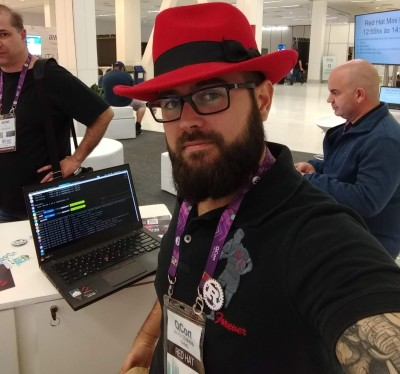

In 2017 I created a [Youtube](https://youtube.com/CodeShowBR) channel dedicated to teaching Flask and Python and since then I have been sharing videos with programming tips.

That same year I started to learn the [Rust language](https://rust-lang.org) and to participate in the Rust community and I became a language enthusiast.

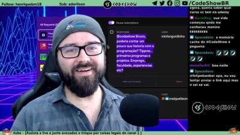

In 2019 I started to share my Rust learnings in the form of live coding on twitch, the experience was quite successful that this became one of my main projects (and practically a second job) since then I do streams 3 times a week on [CodeShow](https://twitch.tv/codeshow) one channel dedicated to Python and Rust, in 2020 I became a **Verified Partner** of Twitch, a member of the [Live Coders](https://twitch.tv/teams/livecoders) and [Live Coders Brasil]((https://twitch.tv/teams/livecodersbrasil)) teams and I have been bringing educational programming content in a free and open way.

After 4 years working in the testing area in 2020 I returned to work as a web developer on the [Red Hat Ansible Galaxy Project](https://galaxy.ansible.com/), an Ansible roles repository developed in Python and Django.

Other curiosities about me:

I am married to [KarlaMag](https://twitch.tv/KarlaMag), an excellent photographer who is now also learning to program in Python and is also very involved with the Live Coding community and in 2018 we deployed our main project, [Erik](https://instagram.com/erikices) :)

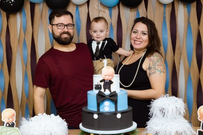

I have been a vegetarian since I was born (I never ate anything of meat) and since 2003 I’m vegan (I don’t eat anything of animal origin).

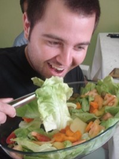

The only sport I like is cycling, I am passionate about classic cycling and I have participated in vintage bicycle racing events like Eroica and Eroica Punta Del Este.

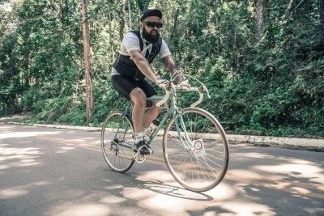

As a teenager I sang in a Progressive Heavy Metal band and to this day I still enjoy all aspects of heavy metal, but in addition I also listen to Brazilian music and especially brega music.

If I were not a programmer I would probably work in the area of ​​food, handmade and made very slowly. I like cooking vegan food and I also love making bread.

I like tattoos a lot and I have over 30 mostly animals like rats, roosters, frogs and others.

I do not like to play video games, as much as I am interested in the game development area it is only for the programming involved, playing is something that I am not used to.

The thing I like to do most is to learn new technical and non-technical skills and then share the acquired knowledge with the community :) (a.k.a #teaching #mentoring)
